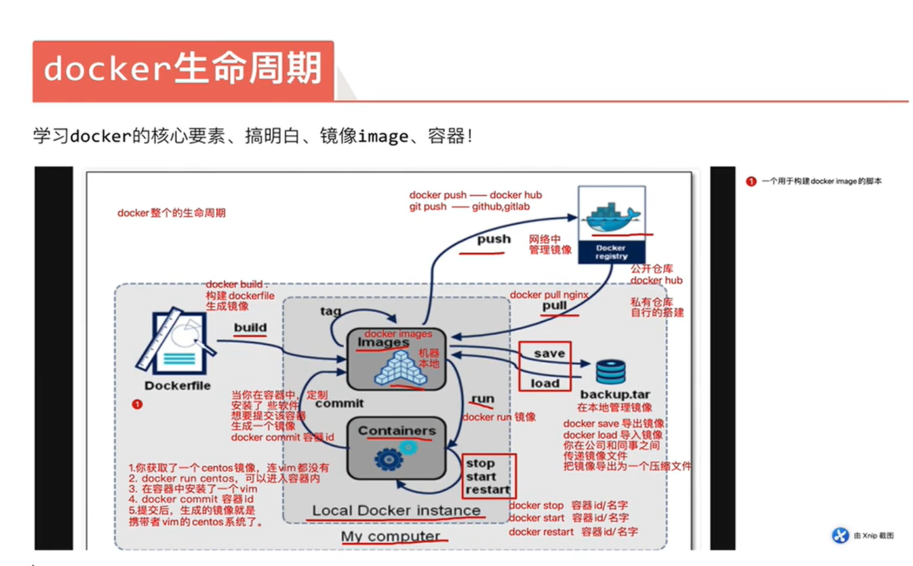

# 3.docker部署及使用

# Docker 容器使用与打包镜像

## docker 创建容器的流程：

```bash
1）执行docker run命令创建容器
2）会检查本地是否有镜像，没有则去cokerhub拉镜像
3）调用docker api连接服务器
4）服务端调用底层的runc启动容器
5）使用namespace进行资源隔离
6）使用cgroup资源限制
```

## docker 远程连接方式（不安全）

```bash
# 远程连接
ExecStart=/usr/bin/dockerd -H tcp://0.0.0.0:2375 -H unix://var/run/docker.sock -H fd:// --containerd=/run/containerd/containerd.sock
 
# 换一台机器可以连接
docker -H 10.0.0.101 images
```

## docker 为何会启动就退出容器

```bash
# 原因：
docker容器中的，pid为1的守护进程结束了
 
1）一个容器只做一件事
2）如果想让docker持续运行，必须让pid为1的守护进程在前台运行
3）在docker run时结尾加上命令，则可以修改docker运行时pid为1的守护进程
```

## 容器名词解析

```bash
# 查询容器进程
[root@web01 ~]# docker ps
CONTAINER ID   IMAGE     COMMAND   CREATED         STATUS         PORTS     NAMES
10b069b91955   ubuntu    "bash"    8 seconds ago   Up 7 seconds             busy_lalande
 
CONTAINER ID # docker ID
IMAGE # 镜像名
COMMAND # 守护进程命令
CREATED # 创建的时间点
STATUS # 运行时长
PORTS # 端口状态
NAMES # 容器名
```

## docker 常用命令

```bash
# 查看镜像或容器的详细信息
docker inspect 镜像\容器
```

## docker 使用相关命令 - 容器

```bash
# 查看正在运行的容器
docker ps
## 选项
-a: 查看所有容器（正在运行的和退出的）
-q：只显示容器的ID号
 
# 创建容器
docker create 镜像名:标签
 
# 启动容器（需要有守护进程在前台运行的容器）
docker start 容器ID
 
# 停止容器（需要有守护进程在前台运行的容器）
docker stop 容器ID
 
# 重启容器（需要有守护进程在前台运行的容器）
docker restart 容器ID
 
# 当容器无法stop时，可以强制kill
docker kill 容器ID
 
# 删除容器
docker rm 镜像名\容器ID
 
# 快捷删除所有容器
docker rm -f $(docker ps -a -q)
 
# 重点：运行容器
##1）在终端前台运行容器
docker run 镜像名:标签
 
##2）在后台运行容器
docker run  -d 镜像名:标签
 
##3）指定容器名称（唯一的）
docker run --name 容器名 -d 镜像名:标签
 
##4）启动容器并连接容器
docker run --name 容器名 -it 镜像名:标签 /bin/bash
 
##5）启动容器并连接容器在退出容器后自动删除
docker run --rm --name 容器名 -it 镜像名:标签 /bin/bash
 
##6）docker服务重启后，容器开机自启
docker run --restart always --name 容器名 -it 镜像名:标签 /bin/bash
 
# 7）连接容器
docker exec -it 容器名\容器ID /bin/bash
 
# 8）拷贝本地文件到容器
docker cp 本地文件 容器名\容器ID:/
 
# 9）拷贝容器中的文件到本地
docker cp 容器名\容器ID:文件路径 /本地路径 
 
# 10）在容器中退出
exit
```

| docker run 选项  | 作用                   |
| ---------------- | ---------------------- |
| -d               | 放在后台运行           |
| --name           | 指定容器名称           |
| -i               | 交互式操作             |
| -t               | 给容器提供一个终端 tty |
| --rm             | 退出容器后自动删除     |
| --restart always | 容器版开机自启         |
| -p（小）         | 指定端口映射           |
| -P（大）         | 随机端口映射           |
| -v               | 映射数据卷             |

## 容器端口映射

```bash
# 先查看声明了哪些端口
[root@docker01 ~]# docker inspect nginx
            "ExposedPorts": {
                "80/tcp": {} ## 仅仅只是一个声明，并不代表只能映射这个端口
            },
 
# 指定端口映射
[root@docker01 ~]# docker run --name web01 -p 8088:80 -d nginx:1.25
-p # 指定端口
8088 # 宿主机的端口
80 # 容器的声明的端口
```

网页访问


```bash
# 指定IP和端口映射（取决于宿主机上有多少网卡或虚拟ip）
[root@docker01 ~]# docker run --name web02 -p 10.0.0.101:80:80 -d nginx:1.25
[root@docker01 ~]# docker run --name web03 -p 172.16.1.101:80:80 -d nginx:1.25
```

网页访问


```bash
# 随机端口映射（大P）
[root@docker01 ~]# docker run --name web04 -P -d nginx:1.25
bd602c84e1f81352fd3bbf20163dc50599d23e292de6614f6011c9c58e30da47
 
# 查看映射的随机端口
[root@docker01 ~]# docker ps
CONTAINER ID   IMAGE        COMMAND                  CREATED          STATUS          PORTS                                     NAMES
bd602c84e1f8   nginx:1.25   "/docker-entrypoint.…"   3 seconds ago    Up 3 seconds    0.0.0.0:32768->80/tcp, :::32768->80/tcp   web04
 
# 指定IP的随机端口映射（小p）
[root@docker01 ~]# docker run --name web05 -p 10.0.0.101::80 -d nginx:1.25
-p 宿主机IP::容器端口
-p 宿主机IP::容器端口/udp
## 范围随机
-p 1-65535:1-65535
```

网页访问


## 使用 docker 运行 nginx 做小游戏

```bash
# 没有使用数据卷映射时的操作
## docker运行nginx容器
[root@docker01 ~]# docker run --name web01 -p80:80 -d nginx:1.25
 
## 编写小游戏的nginx配置文件
[root@docker01 ~]# vim game.conf
server {
    listen 80;
    server_name _;
 
    location / {
        root /h5_games;
        index index.html;
    }
}
 
## 解压导入的h5_games.zip
[root@docker01 ~]# unzip h5_games.zip
 
## 把本地的h5_games复制到web03容器的根目录下
[root@docker01 ~]# docker cp h5_games web03:/
 
## 把本地的nginx配置文件复制到web03容器的存放nginx配置文件目录下
[root@docker01 ~]# docker cp game.conf web03:/etc/nginx/conf.d/
 
## 连接web03容器
[root@docker01 ~]# docker exec -it web03 bash
 
## 重新加载nginx配置文件
root@b0fec2e192ae:/# nginx -s reload
```


## 数据卷映射

```bash
# -v 宿主机目录:容器目录
docker run --name web01 -p 80:80 -v /root/h5_games:/usr/share/nginx/html -d nginx:1.25
 
# -v 容器目录（宿主机随机目录）
docker run --name web01 -p 80:80 -v /usr/share/nginx/html -d nginx:1.25
```

## 手动制作镜像

```bash
# 1.首先要启动一个基础镜像
[root@docker01 ~]# docker run -it centos:7 bash
 
# 2.换源
[root@dae50b1696c5 /]# bash <(curl -sSL https://linuxmirrors.cn/main.sh)
 
# 3.安装ngixn
[root@dae50b1696c5 /]# yum install -y nginx vim unzip
 
# 4.写配置文件
[root@dae50b1696c5 /]# vim /etc/nginx/conf.d/h5_games.conf
server {
    listen 80;
    server_name _;
 
    location / {
        root /code;
        index index.html;
    }
}
 
# 5.创建站点目录
[root@dae50b1696c5 /]# mkdir /code
 
# 6.起另一个终端传输文件
[root@docker01 ~]# unzip h5_games.zip
[root@docker01 ~]# docker cp h5_games dae50b1696c5:/code
 
# 7.放到当前目录
[root@dae50b1696c5 /]# cd /code
[root@dae50b1696c5 code]# mv h5_games/* .
 
# 8.启动nginx
[root@dae50b1696c5 code]# nginx
 
# 8.另一个终端将容器打成镜像
[root@docker01 ~]# docker commit dae50b1696c5 nginx_h5:v1
 
# 9.导出镜像
[root@docker01 ~]# docker save nginx_h5:v1 > /tmp/h5.tgz
 
# 10.拷贝镜像
[root@docker01 ~]# scp /tmp/h5.tgz 172.16.1.102:/tmp
 
# 11.导入镜像
[root@docker02 ~]# docker load < /tmp/h5.tgz
 
# 12.启动
[root@docker02 ~]# docker run -p 80:80 -d nginx_h5:v1 /sbin/nginx -g 'daemon off;'
```

## Docker的生命周期

